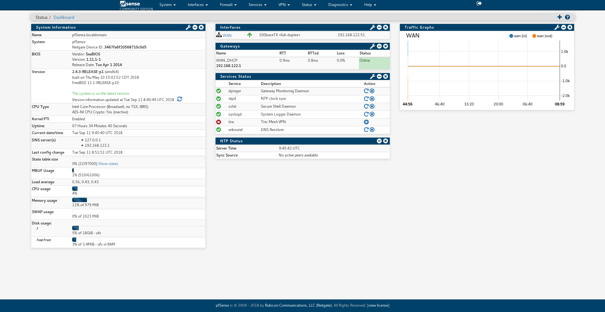

A blue version of [pfSense](https://github.com/pfsense/pfsense) compact red theme with a few minor fixes and adjustments.
## Screenshots

## To install
1. Enable SSH on pfSense
2. Open pfSense filesystem and copy Compact-BLUE.css to /usr/local/www/css
3. At pfSense settings, go to System -> General Setup then choose Compact-BLUE at webConfigurator section. Press 'Save' at the bottom of the page then navigate to the main page,